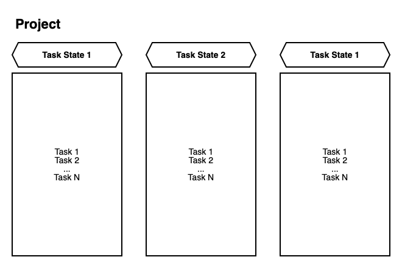
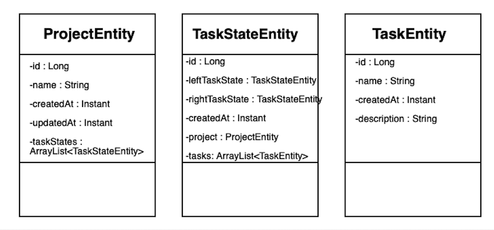

# task-manager-api
## Overview
A REST microservice for scheduling tasks. 
Implemented a task manager that allows you to work on projects. The intended structure of the project that can be worked on using the task manager:


Entities are used to work on the project are: __ProjectEntity__, __TaskStateEntity__, __TaskEntity__, they are shown in the diagram:


The application uses __PostgreSQL__ as a database and frameworks: __Hibernate__ and __Spring__.

## Usage
Examples of using the microservice are described below.

### 1.1. Fetching projects
Upon this __GET__-request, we can get a list of all projects:
```HTTP
http://localhost:8080/api/projects
```
The response will look like this:
```JSON
[
    {
        "id": 1,
        "name": "projectName",
        "created_at": "2022-10-31T12:22:29.611745Z",
        "updated_at": "2022-10-31T12:22:29.611738Z"
    }
    
    ...
]
```

We can also get project containing prefix in their name:
```HTTP
http://localhost:8080/api/projects?prefix_name=prefix
```

### 1.2. Creating or updating a project
Using this __PUT__-request we can create a new project with name __projectName__ or update an existing one:
```HTTP
http://localhost:8080/api/projects?project_name=projectName
```
The response will look like this:
```JSON
{
    "id": 7,
    "name": "projectName",
    "created_at": "2022-10-31T12:22:29.611745Z",
    "updated_at": "2022-10-31T12:22:29.611738Z"
}
```

### 1.3. Deleteing a project
Upon this __DELETE__-request, we can delete project by __project_id__ (deleteing a project with __project_id__ = 12):
```HTTP
http://localhost:8080/api/projects/12
```

### 2.1. Getting project's TaskStates:
Upon this __GET__-request we can get TaskStates of project with __project_id = 1__:
```HTTP
http://localhost:8080/api/projects/{project_id}/task-states?project_id=1
```
### 2.2 Creating a new TaskState
Using this __POST__-request we can create a new task state named __"Finished"__ for project with __project_id = 1__:
```HTTP
http://localhost:8080/api/projects/{project_id}/task-states?project_id=1&task_state_name=Finished
```

### 2.3 Updating a TaskState
We can also update TaskState using __PATCH__-request:
```HTTP
http://localhost:8080/api/task-states/{task_state_id}?task_state_id=1&task_state_name=Finished
```

### 2.4 Changing TaskState's position
Also, using the __PATCH__ request, we can change the position of the specified TaskState with __task_state_id=3__ with a TaskState with __left_task_state_id=2___:
```HTTP
http://localhost:8080/api/task-states/{task_state_id}/position/change?task_state_id=3&left_task_state_id=2
```

### 2.5 Deleting TaskState
Upon this __DELETE__-request we can delete TaskState of project by __task_state_id=3__:
```HTTP
http://localhost:8080/api/task-states/{task_state_id}?task_state_id=3
```


